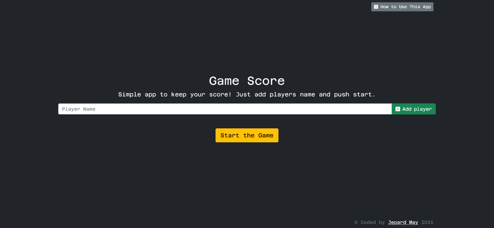
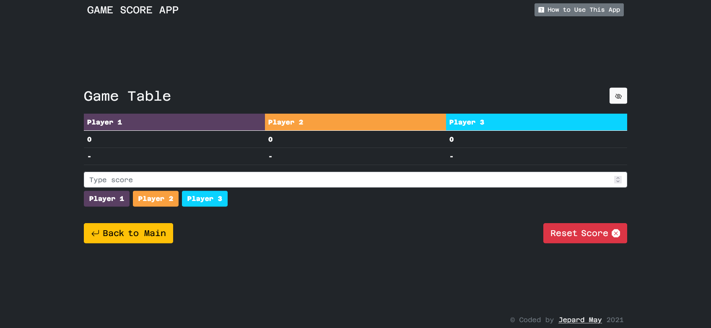
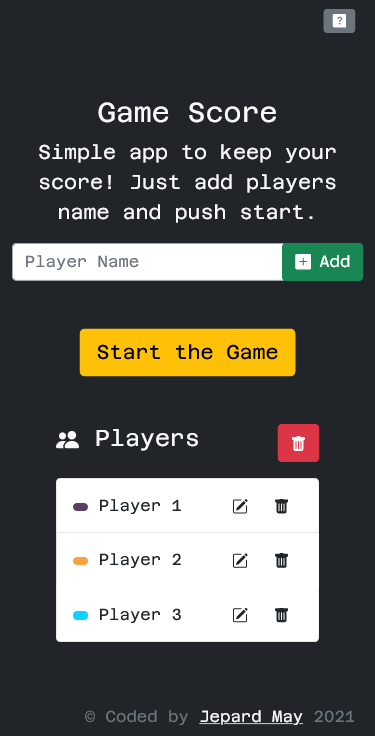
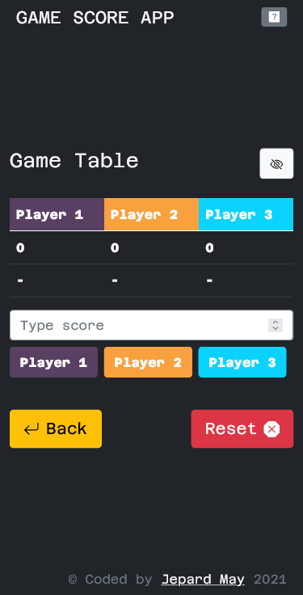

# Game score helper - Simple app to keep your score

## Overview

### About the app
The app was created to calculate scores in games like scrabble, to keep track of the players' scores.

Users should be able to:

- Get how to use the app in the rules' modal.
- Add players one by one or through a comma.
- Edit or delete each player, also delete all at once.
- Add score to a particular player and see the last added score of each player.
- Show and hide each player's current score.
- Reset all scores.
- Keep states after page's refreshing.

### Screenshot

 
 

### Links

- Live Site URL: [Netlify](pensive-jang-6619ed.netlify.app/)

## My process

### Built with

- Desktop-first workflow
- [Bootstrap](https://getbootstrap.com/)
- [Reactstrap](https://reactstrap.github.io/)
- [React](https://github.com/facebook/create-react-app)

### Available Scripts

In the project directory, you can run:

- #### `npm start`
- #### `npm test`
- #### `npm run build`

### What I learned

- How to use some of the React hooks.
- Pass props to components.
- How to use Reactstrap (first use)
- How to update the state, when one of the elements is deleted or edited.
- When to use a key on the element.

## Author

- GitHub - [Veronika Palto](https://github.com/JepardMay)
